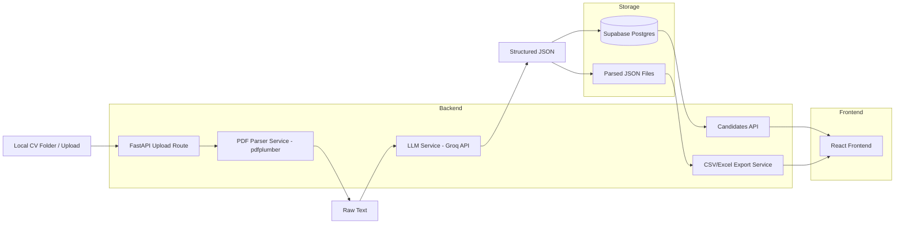

# TALASH System Architecture (Milestone 1)

## Detailed Data Flow

1. User provides CVs either by uploading files or by passing a local folder path.
2. Backend scans all PDF files and extracts raw text from each document.
3. Raw CV text is sent to a Groq-hosted model with a strict JSON extraction prompt.
4. Extracted structured JSON is persisted in DB and also saved to disk.
5. Flattened records are exported into CSV and Excel for milestone submission.
6. Frontend reads candidate APIs to display table, detail pane, chart metrics, and email draft.
